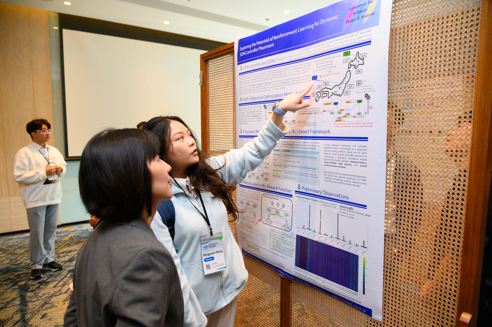

Ms. Kang Xingyuan, and Mr. Papon Choonhaklai each presented thier individual research in the Poster session at [CENTRA 2026 in Bangkok, Thailand (CENTRA 9)](https://www.globalcentra.org/centra9/).

First, Ms. Kang Xingyuan presented her research titled "Exploring the Potential of Reinforcement Learning for Dynamic SDN Controller Placement" to the audience. The details of her study are as follows:

> Kang Xingyuan, Keichi Takahashi, Chawanat Nakasan, Kohei Ichikawa, Hajimu Iida, "Exploring the Potential of Reinforcement Learning for Dynamic SDN Controller Placement", CENTRA 2026, January 11–13, 2026.

This research addresses the Controller Placement Problem (CPP) in distributed Software-Defined Networking (SDN) by proposing a reinforcement learning (RL)-based approach to improve adaptability and efficiency. Traditional multi-objective optimization methods perform well in static environments but struggle to handle dynamic network conditions due to limited flexibility and high computational cost. To overcome these limitations, CPP is formulated as a sequential decision-making problem, where an RL agent learns optimal controller placement strategies through interaction with the environment. The proposed framework incorporates the Flow Setup Time (FST) model to capture end-to-end latency and the Variance of Load Balancing (VOLB) to evaluate workload distribution. These metrics are integrated into the reward function to jointly optimize latency and load balancing. Experiments using real-world traffic datasets demonstrate that network conditions are highly dynamic and irregular, highlighting the limitations of static approaches. The results show that the proposed RL-based method can effectively adapt to changing environments, improving scalability, reducing communication overhead, and enhancing overall network performance.

<!-- Papon san's session -->
Next, Mr. Papon Choonhaklai presented his research titled "A proposal of Metric-Driven Scheduling Method for GPU Inference Workloads in Kubernetes Clusters" to the audience. The details of his study are as follows:

> Papon Choonhaklai, Kohei Ichikawa, Kundjanasith Thonglek, Hajimu Iida, "A proposal of Metric-Driven Scheduling Method for GPU Inference Workloads in Kubernetes Clusters", CENTRA 2026, January 11–13, 2026.

This research proposes a metric-driven scheduling method to improve GPU utilization for machine learning inference workloads in Kubernetes clusters. With the rapid growth of AI services, GPUs are often underutilized due to coarse-grained allocation and static resource management, leading to inefficiencies in multi-tenant environments. To address this issue, we introduce a scheduling framework based on Multi-Process Service (MPS) that enables fine-grained GPU sharing. The proposed method dynamically allocates GPU resources by leveraging real-time metrics such as GPU utilization and memory usage, collected through monitoring tools. These metrics are integrated into a scheduling strategy that adaptively assigns workloads to optimize resource efficiency. The system is implemented as a Kubernetes-native operator, allowing seamless integration with existing cluster management mechanisms. Experimental evaluations using inference workloads demonstrate that the proposed approach significantly improves GPU utilization and overall throughput compared to conventional scheduling methods. The results indicate that metric-driven scheduling provides an effective and scalable solution for managing GPU resources in modern cloud-native environments.
