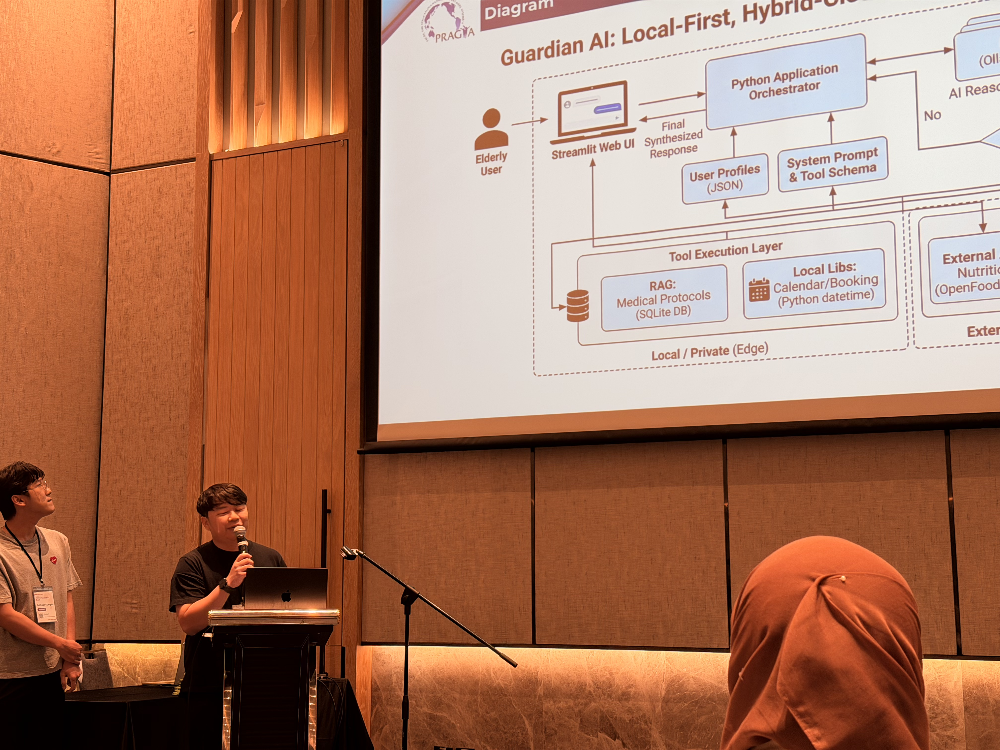

Ms. Kang Xingyuan, and Mr. Papon Choonhaklai each presented thier individual research in the Technical Paper session at [PRAGMA 2026 in Bangkok, Thailand (PRAGMA 41)](https://www.pragma-grid.net/pragma41/).

The conference consisted of two parts: <b>Student Hackathon</b> and <b>Presentation</b>. 

In the <b>Student Hackathon</b>, participants were divided into topic-based groups and given one day to complete their projects, all centered on AI applications. For instance, my group developed an AI-based system to generate personalized escape routes in emergency situations and used the GRAMA simulator to model the agents’ learning process.

Ms. Kang Xingyuan's group project was honored to receive recognition from the community and was awarded the "Giant Award".

Next was the <b>Presentation</b> session. Ms. Kang Xingyuan first presented her research titled "Adaptive Reinforcement Learning for Dynamic Controller Placement in Distributed SDN" to the audience. The details of her study are as follows:

> Kang Xingyuan, Keichi Takahashi, Chawanat Nakasan, Kohei Ichikawa, Hajimu Iida, "Adaptive Reinforcement Learning for Dynamic Controller Placement in Distributed SDN", PRAGMA 2026, January 8–11, 2026.

This research addresses the Controller Placement Problem (CPP) in distributed Software-Defined Networking (SDN) by proposing an adaptive reinforcement learning (RL)-based framework. Traditional multi-objective optimization methods struggle in dynamic environments due to limited flexibility and high computational overhead. To overcome these limitations, CPP is modeled as a sequential decision-making problem, where an RL agent learns optimal controller placement strategies through continuous interaction with the network. The framework integrates Flow Setup Time (FST) to measure end-to-end latency and Variance of Load Balancing (VOLB) to quantify workload distribution, both incorporated into the reward function. Using real-world dynamic traffic datasets, the proposed approach enables adaptive responses to traffic fluctuations and topology changes. The results demonstrate improved scalability, reduced communication overhead, and enhanced overall network performance compared to static optimization methods.


<!-- Papon san's session -->
Next, Mr. Papon Choonhaklai presented his research titled "A Comparative Study of GPU Sharing Techniques for Inference Workloads in Kubernetes Clusters" to the audience. The details of his study are as follows:

> Papon Choonhaklai, Kohei Ichikawa, Kundjanasith Thonglek, Hajimu Iida, "A Comparative Study of GPU Sharing Techniques for Inference Workloads in Kubernetes Clusters", PRAGMA 2026, January 8–11, 2026.

This research investigates GPU sharing techniques for machine learning inference workloads in Kubernetes clusters and proposes a metric-driven scheduling method to improve resource utilization. Conventional GPU allocation in Kubernetes is coarse-grained, leading to significant underutilization, especially for inference workloads with low resource demand. To address this issue, the proposed method combines NVIDIA Multi-Process Service (MPS) with real-time GPU metrics collected via DCGM and Prometheus. Implemented as a Kubernetes-native operator, the system dynamically adjusts GPU resource allocation based on utilization and memory usage, enabling efficient multi-tenant scheduling. Experimental results using BERT-based inference workloads demonstrate that the proposed approach achieves higher GPU utilization and reduced total execution time compared to static sharing methods. These findings highlight the effectiveness of metric-driven scheduling for improving throughput in cloud-native environments.


We are pleased that Mr. Papon Choonhaklai’s research was recognized by the community, earning second place and a small prize.
