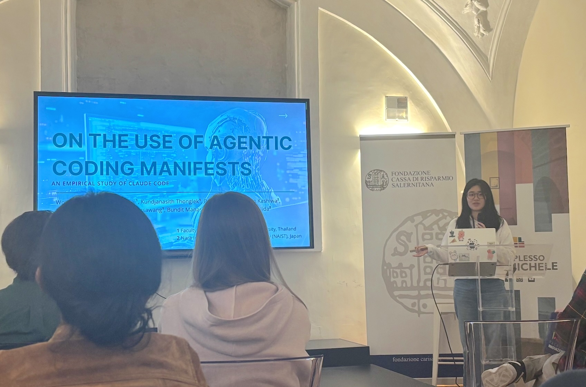

Mr. Kanaji from our laboratory, along with Ms. Amy and Ms. Tonnam from Kasetsart University, attended the [26th International Conference on Product-Focused Software Process Improvement (PROFES 2025)](https://conf.researchr.org/home/profes-2025), which was held in Salerno, Italy, from December 1 to 3, 2025. The three authors submitted their papers to the short paper track of PROFES, where their work was accepted and presented. The acceptance rate for the short papers was 68%.

Mr. Kanaji presented his work titled “An Empirical Study of Security-Policy Related Issues in Open Source Projects.”
This study focuses on SECURITY.md, a file used to report vulnerabilities in GitHub repositories, and investigates the reasons behind its low adoption rate. Specifically, the study analyzed Issues related to SECURITY.md and five other community health files to identify the factors that hinder its adoption. The results revealed that, in some cases, the introduction of SECURITY.md can instead cause confusion among contributors.

Ms. Amy presented her work titled "On the Use of Agentic Coding Manifests: An Empirical Study of Claude Code."
This study investigates the role and characteristics of agent manifests in agentic coding tools. In the presentation, she analyzed 253 Claude.md files collected from 242 repositories to identify structural features, content trends, and common patterns in these manifests.
The results revealed that manifests generally exhibit a shallow hierarchical structure consisting of one main heading and several subsections, with most content focusing on operational commands, technical implementation notes, and high-level architectural descriptions.

Ms. Tonnam presented a work titled "Detecting and Characterizing Low and No Functionality Packages in the NPM Ecosystem."
The study examines trivial packages, which offer minimal functionality, and data-only packages, which contain no executable logic. A rule-based static analysis method was developed to detect these packages and to assess their prevalence and associated security risks in the 2025 npm ecosystem.
The analysis showed that 17.92% of packages were trivial, with vulnerability levels similar to non-trivial ones, and that data-only packages, though less common, also pose risks. The proposed detection tool achieved 94% accuracy (macro-F1 0.87), demonstrating its usefulness for large-scale analysis and reducing security exposure.

