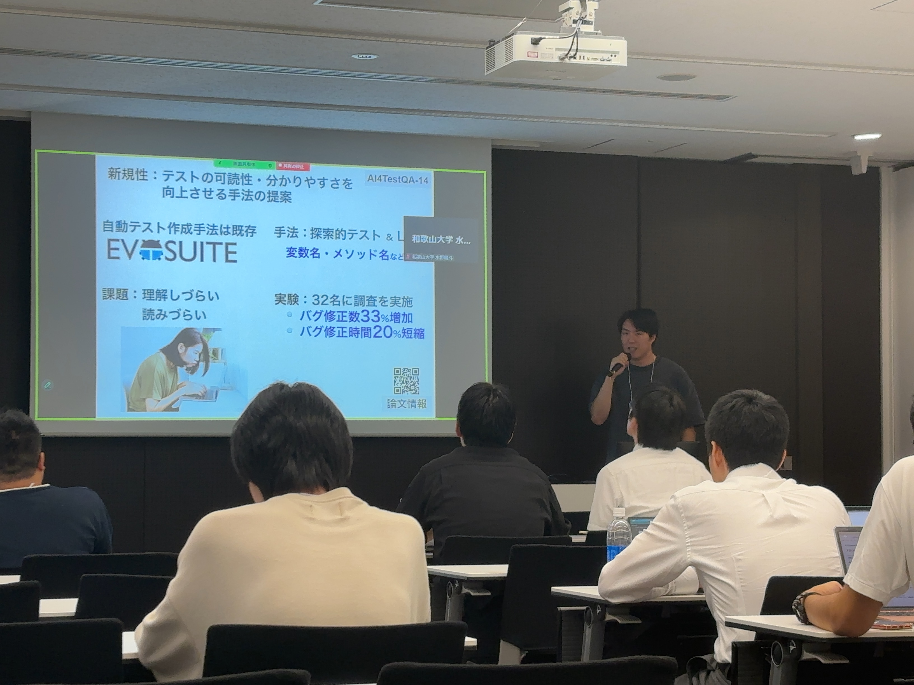
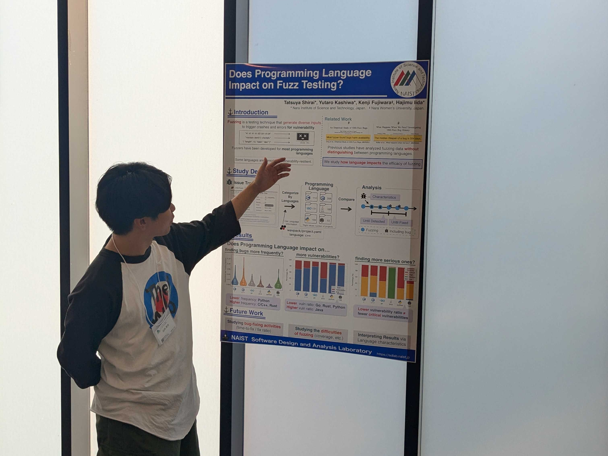

Horikawa presented in the Poset Presentation Track, titled "nderstanding Refactoring in Test Code: An Empirical Study". This study systematizes and investigates the impact of refactorings that are specific to test code. The analysis revealed 37 types of test-specific refactorings, which were shown to be effective against test smells.

Shirai presented in the Poster Presentation Track, titled "Does Programming Language Impact on Fuzz Testing?". The study investigated the impact of programming languages on fuzzing. In the presentation, six programming languages were compared in terms of the frequency of issue occurrences, the proportion of vulnerabilities, and the severity of vulnerabilities. The results revealed that in languages where vulnerabilities were less likely to occur, the vulnerabilities that did occur tended to be more severe.

Kanaji presented in the Poster Presentation Track, titled "An Empirical Study of Security-Policy Related Issues in Open Source Projects." In this study, he investigated the reasons why the SECURITY.md file is not widely used by analyzing issues related to this file. As a result, he found that in some cases the introduction of SECURITY.md has caused confusion among contributors.

Watanabe presented in the Poster Presentation Track, titled “Towards Leveraging Program Invariant Changes for Just-In-Time Defect Detection.” Starting from the hypothesis that invariants could be used as dynamic features for JIT defect detection, he analyzed whether errors caught by test code could be detected through changes in invariants. The results confirmed, via box plots showing significant differences, that only bug-containing commits exhibited changes in the number of lines and characters of invariants.

