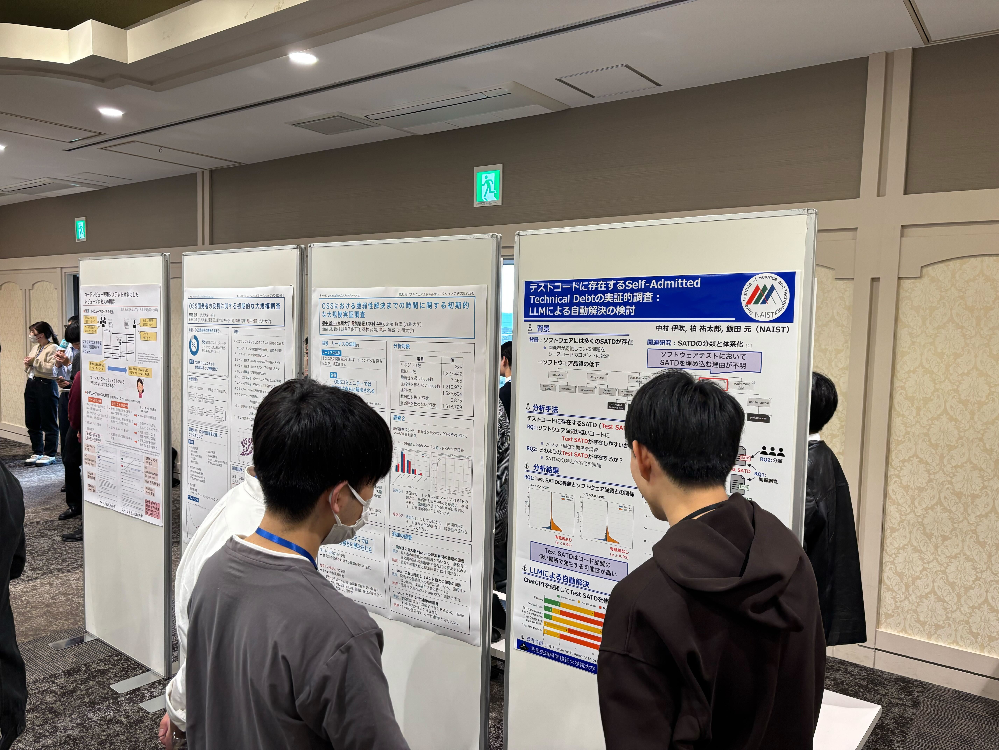

本研究室の我妻諒治君，中村伊吹君が2024年11月28日〜30日に行われた[第31回ソフトウェア工学の基礎ワークショップ(FOSE2024)](https://fose.jssst.or.jp/fose2024/)で発表を行いました．

我妻君は「自動運転シミュレーションテスト結果を用いたソフトウェア品質分析」を発表しました．本研究では自動運転シミュレーションテスト結果とソフトウェア品質との関係について分析しました．その結果，シミュレーションテストが失敗するグループではコードスメルや複雑度といったソフトウェア品質メトリクスが高い傾向にあることを明らかにしました．

中村君は「テストコードに存在するSelf-Admitted Technical Debtの実証的調査：LLMによる自動解決の検討」を発表しました．本研究ではテストコードに存在するSATDとソフトウェア品質との関係について調査しました．その結果，テストコードのSATDはコード品質が低い箇所で発生する可能性が高く，テストの品質を示す指標とは独立して発生する可能性が高いことを明らかにしました．また，特定の種類のSATDがLLMを用いて自動解決できる可能性があることも示しました．

