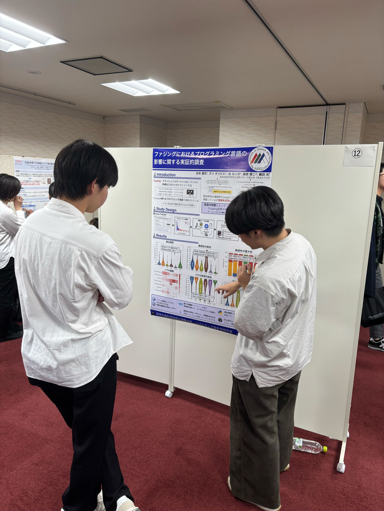
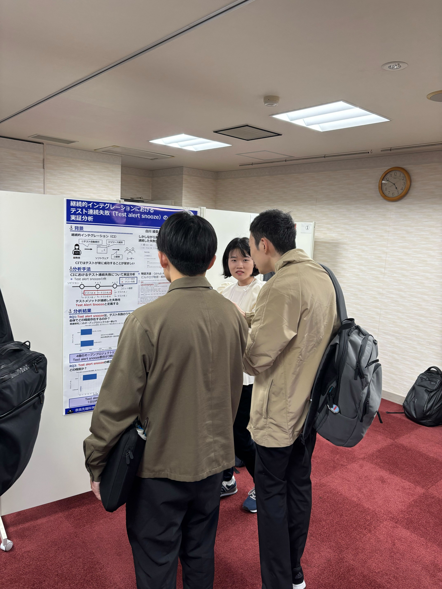
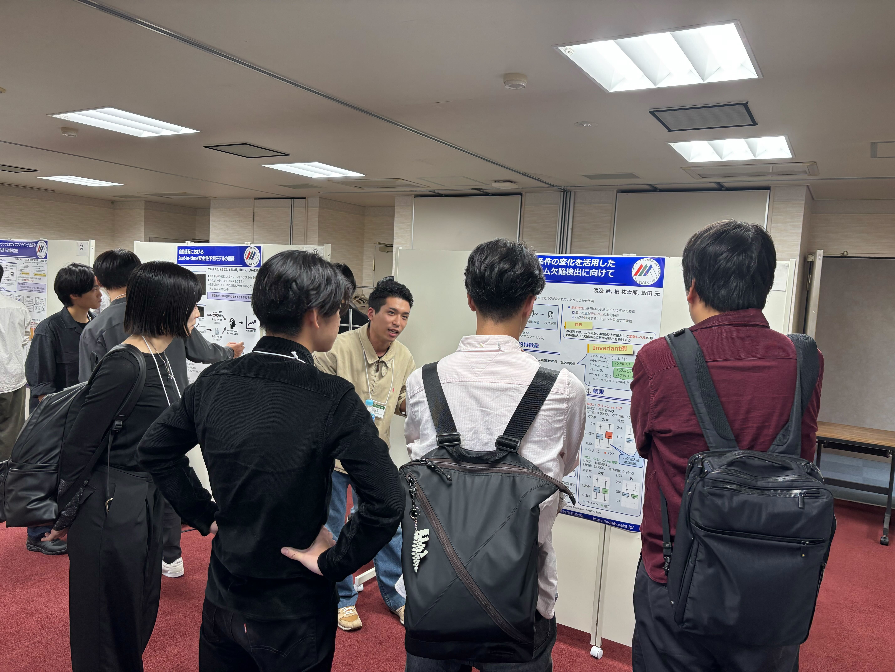

本研究室の白井達也君，伊藤慶太郎君，白川綾音さん，渡邊幹君が2025年11月6日〜8日にかけて行われた[第32回ソフトウェア工学の基礎ワークショップ(FOSE2024)](https://fose.jssst.or.jp/fose2025/)で発表を行いました．

白井君は「ファジングにおけるプログラミング言語の影響に関する実証的調査」を発表しました．本研究では，ソフトウェアの自動テスト手法であるFuzzing（ファジング）に着目し，プログラミング言語ごとの特徴がFuzzing結果に与える影響を大規模に分析しました．その結果，検出されるバグの傾向やカバレッジなどの指標に言語間で有意な差があることを明らかにし，言語の特性に応じたFuzzing手法の最適化が重要であることを示しました．

伊藤君は「」

白川さんは「継続的インテグレーションにおけるテスト連続失敗（Test alert snooze）の実証分析」を発表しました．既存研究では，継続的インテグレーション（CI）におけるテスト連続失敗について実態や原因などが明らかになっていません．そこで，本研究では，テストメゾットが連続した失敗をTest alert snoozeと定義し，その特徴を分析しました．その結果，Test alert snoozeの割合，継続して失敗した数，修正時間が棒グラフと箱ひげ図で確認できました．

渡邊君は「プログラム不変条件の変化を活用したジャストインタイム欠陥検出に向けて」というタイトルで発表しました．JIT欠陥検出の動的特徴量としてinvariantが使用できないかという仮説から，テストコードで引っかかるエラーをinvariantの変化から検知できるかということを分析しました．結果としてバグ混入コミットのみinvariantの行数，文字数に変化が現れることが有意差と箱ひげ図で確認できました．

