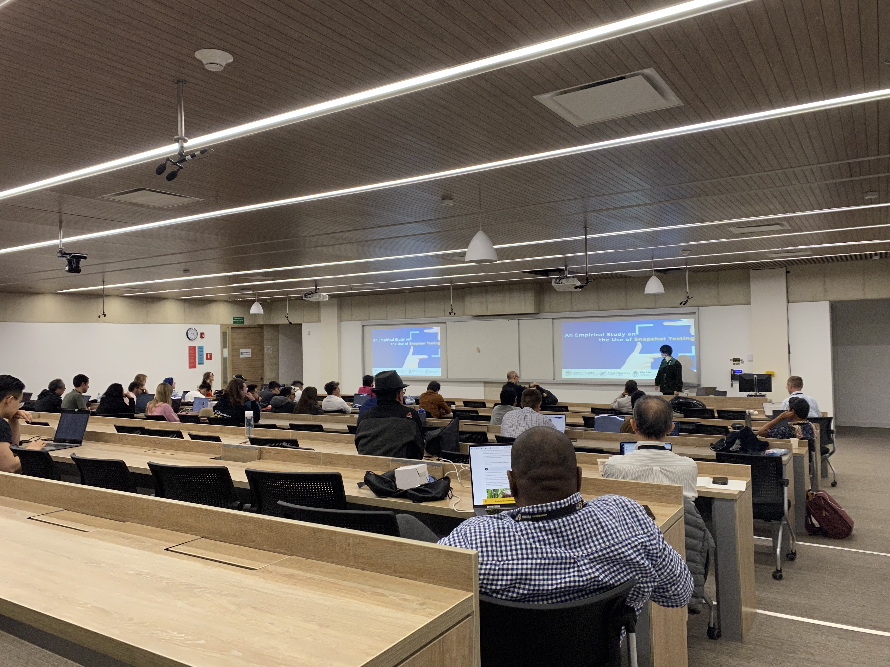

本研究室のインターンシップ生である藤田駿君（現，京都大学所属）が2023年10月1日〜6日にかけてコロンビアで開催された[The 39th IEEE International Conference on Software Maintenance and Evolution and Reengineering (ICSME 2023)](https://conf.researchr.org/home/icsme-2023)で下記の論文を発表しました．

> Shun Fujita, Yutaro Kashiwa, Bin Lin, and Hajimu Iida, 
> "An Empirical Study on the Use of Snapshot Testing", In Proceedings of the 39th IEEE International Conference on Software Maintenance and Evolution, pp. 335--440, 2023.

ICSME2023はIEEEが主催するソフトウェアメインテナンスに関する国際会議で，今回で39回目の開催となる歴史あるトップカンファレンスです．藤田君が投稿したERA (Early Research Achivement)トラックでは，33本の投稿のうち13本の論文が採択されました（採択率39%）．

本研究ではスナップショットテストと呼ばれるReactなどの開発で広く用いられるテストがどのように利用されているかについて調査しました．GitHubプロジェクトから約1,500リポジトリを収集し，分析した結果，（1）スナップショットテストと単体テストを利用するプロジェクトでは，単体テストのみを用いるプロジェクトよりも，多くのテストを利用していること（2）8.2%のコミットでスナップショットファイルが変更され，その際には多くのファイルと同時に編集されること等を明らかにしました．
当該論文は[GitHub](https://github.com/Yutaro-Kashiwa/papers/blob/master/ICSME2023_Fujita.pdf)にて公開されています．本研究はインターンシップの一環として実施すると共に，オランダ・Radboud大学との共同研究として実施されました．

