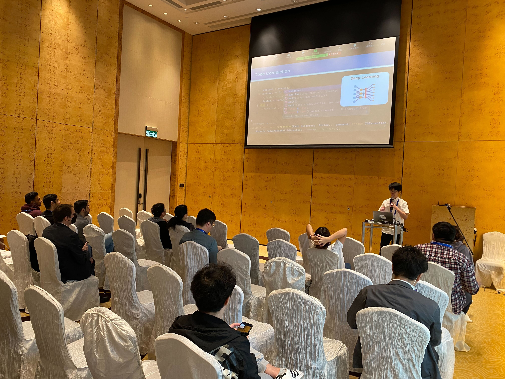

本研究室M2の福本大介君が2023年3月21日〜24日にかけて開催された[30th IEEE International Conference on Software Analysis, Evolution and Reengineering (SANER 2023)](https://saner2023.must.edu.mo/index)で下記の論文を発表しました．

> Daisuke Fukumoto, Yutaro Kashiwa, Toshiki Hirao, Kenji Fujiwara and Hajimu Iida, 
> "An Empirical Investigation on the Performance of　Domain Adaptation for T5 Code Completion", 30th IEEE International Conference on Software Analysis, Evolution and Reengineering (SANER 2023), Mar. 2023.

SANER2023はIEEEが主催するソフトウェア解析，進化．リエンジニアリングに関する国際会議で，統合前の会議も含めると今回で30回目の開催となる歴史あるトップカンファレンスです．福本君が投稿したERAトラックでは，30本の投稿のうち12本の論文が採択されました（採択率40%）．

本研究では深層学習に基づくコード補完モデルが，プロジェクトのコーディング規約に違反するといった問題に対して，対象プロジェクトのソースコードを用いたドメイン適応の改善効果について調査しました．実験結果として，ソフトウェア工学における最先端のコード関連タスク向けのモデルであるCodeT5を用いた検証結果と，プロジェクトの規模による影響について説明しました．

