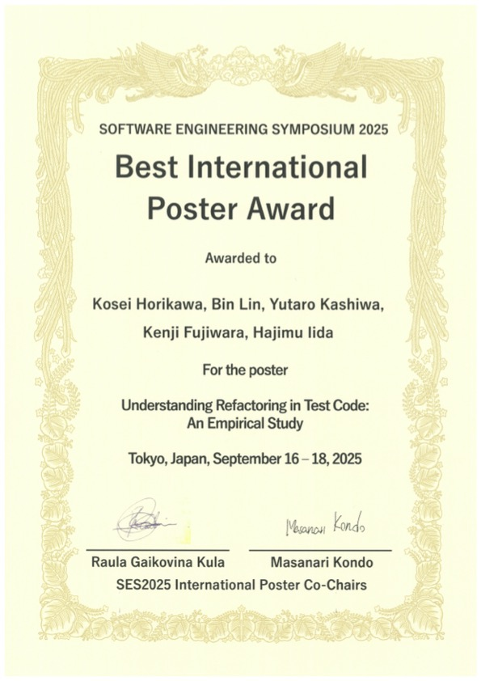

本研究室の堀川康生君が[Software Engineering Symposium (SES2025)](https://ses.sigse.jp/2025/)にてBest International Poster Awardを受賞しました．
SES2025の特別企画である学生国際英語ポスターセッションは，自身の研究成果を英語で発表し，ビクトリア大学のDaniel German教授やフアン・カルロス王大学David Moreno助教といった国際的に著名な研究者と議論する貴重な機会です，本賞は，そのセッションにおいて特に優れたポスター発表に対して贈られるものです．

堀川君は，Understanding Refactoring in Test Code: An Empirical Studyというタイトルで発表を行いました．本研究は，テストコードの品質を改善するために行われるテスト固有リファクタリングについて分析したものです．分析の結果，37種類のテスト固有リファクタリングを特定しました．また，特定のリファクタリングは一部のテストスメル（テストコードの複雑さ等，品質低下を示す指標）を効果的に改善できることが明らかとなりました．

