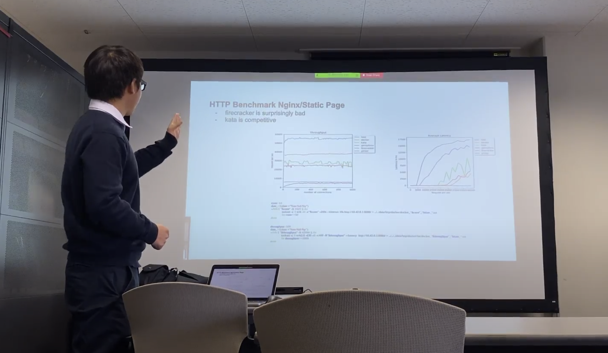

2020年4月13日に，ソフトウェア設計学研究室にインターン生として滞在している
Guoqing Li君が成果報告を行いました．
Li君はチェンマイ大学 (タイ) の学部生であり，今年1月から当研究室で
研究インターンシップに取り組んでいました．

Li君の研究テーマは "Comparative Performance Study of Cloud Native Hypervisors"
で，従来のコンテナランタイムより分離性を向上したコンテナランタイムや
ハイパーバイザの性能を多角的な視点から比較評価したものです．

