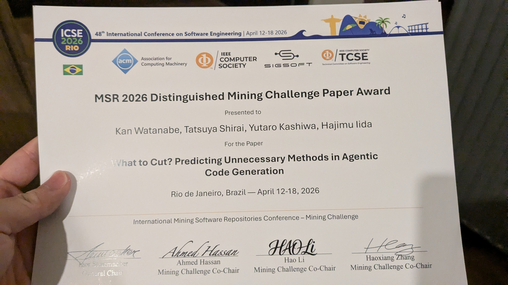

本研究室の渡邊幹君が[23rd International Conference on Mining Software Repositories (MSR 2026)](https://2026.msrconf.org)にてDistinguished Mining Challenge Paper Awardを受賞しました．
MSR2026におけるMining ChallengeはMSRカンファレンスが毎年開催する競技トラックであり，主催者が提供する特定のデータセットを参加者が各自で分析し，ソフトウェアエンジニアリングに関する独自の知見を競います．特に優れた論文がDistinguished Mining Challenge Paper Awardとして表彰されます．

渡邊君は，What to Cut? Predicting Unnecessary Methods in Agentic Code Generationというタイトルで発表を行いました．本研究は，プルリクエストのレビュー時に削除されるAI生成メソッドを効率よく特定することを目的としています．削除されるメソッドは削除されないメソッドとは特徴が異なることが明らかになりました．また，提案した予測モデルがこうした不要メソッドをAUC 87.1%で特定できることを示し，コードレビューの効率化に貢献します（[doi:10.1145/3793302.3793591](https://dl.acm.org/doi/full/10.1145/3793302.3793591)）．

> Kan Watanabe, Tatsuya Shirai, Yutaro Kashiwa, and Hajimu Iida,
> "What to Cut? Predicting Unnecessary Methods in Agentic Code Generation", In Proceedings of the 23rd International Conference on Mining Software Repositories (MSR 2026), pp. 868--872, 2026. [https://doi.org/10.1145/3793302.3793591](https://dl.acm.org/doi/full/10.1145/3793302.3793591)

