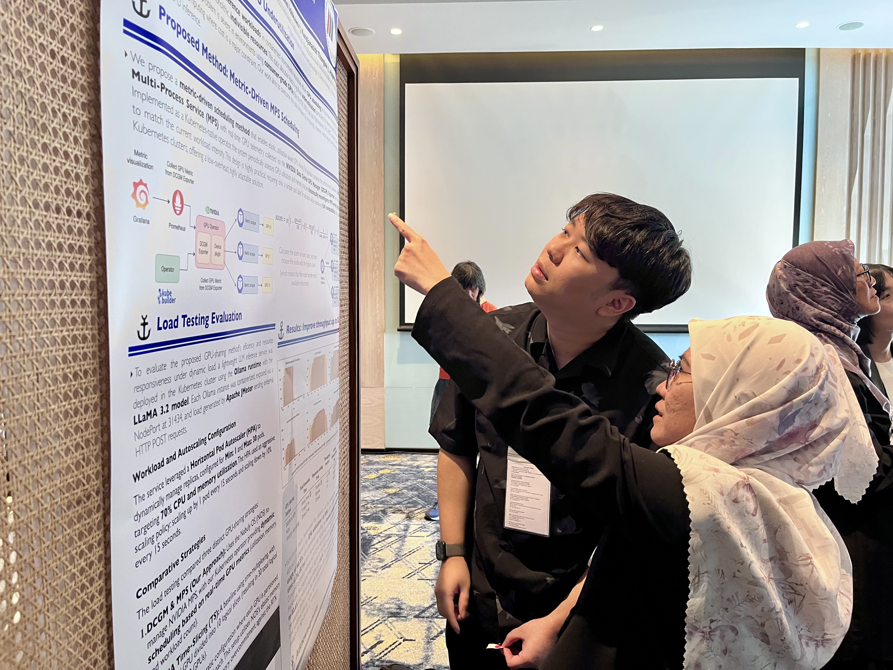

Ms. Kang Xingyuan と Mr. Papon Choonhaklai は、それぞれの研究について、[CENTRA 2026 in Bangkok, Thailand (CENTRA 9)](https://www.globalcentra.org/centra9/) のポスターセッションにおいて発表を行いました。

まず、Ms. Kang Xingyuan は「Exploring the Potential of Reinforcement Learning for Dynamic SDN Controller Placement」と題した研究を発表しました。本研究の詳細は以下の通りです：

> Kang Xingyuan, Keichi Takahashi, Chawanat Nakasan, Kohei Ichikawa, Hajimu Iida, "Exploring the Potential of Reinforcement Learning for Dynamic SDN Controller Placement", CENTRA 2026, January 11–13, 2026.

本研究は，分散型Software-Defined Networking（SDN）におけるコントローラ配置問題（CPP）に対し，適応性と効率性を向上させるための強化学習（RL）ベース手法を提案する。従来の多目的最適化手法は静的環境では有効であるが，動的ネットワーク環境においては柔軟性の不足や計算コストの高さにより適用が困難である。本研究ではCPPを逐次的意思決定問題として定式化し，RLエージェントが環境との相互作用を通じて最適な配置戦略を学習する枠組みを構築する。評価指標として，エンドツーエンド遅延を表すFlow Setup Time（FST）と，負荷分散を評価するVariance of Load Balancing（VOLB）を採用し，これらを報酬関数に統合することで遅延と負荷の同時最適化を実現する。実ネットワークトラフィックデータを用いた実験により，トラフィックが高度に動的かつ不規則であることが確認され，従来手法の限界が示された。提案手法は環境変化に適応し，スケーラビリティの向上，通信オーバーヘッドの削減，およびネットワーク性能の改善に有効であることを示す。

<!-- Papon san's session -->
次に、Mr. Papon Choonhaklai は「A proposal of Metric-Driven Scheduling Method for GPU Inference Workloads in Kubernetes Clusters」と題した研究を発表しました。本研究の詳細は以下の通りです：

> Papon Choonhaklai, Kohei Ichikawa, Kundjanasith Thonglek, Hajimu Iida, "A proposal of Metric-Driven Scheduling Method for GPU Inference Workloads in Kubernetes Clusters", CENTRA 2026, January 11–13, 2026.

本研究は，Kubernetesクラスタにおける機械学習推論ワークロードのGPU利用効率を向上させるために，メトリクス駆動型スケジューリング手法を提案する。AIサービスの急速な普及に伴い，従来の粗粒度なリソース割当や静的管理により，GPUが十分に活用されないという課題が存在する。この課題に対し，本研究ではMulti-Process Service（MPS）を活用した細粒度GPU共有を可能とするスケジューリングフレームワークを提案する。GPU使用率やメモリ使用量などのリアルタイムメトリクスを監視ツールから取得し，これらを基に動的にリソースを割り当てることで，効率的なワークロード配置を実現する。本手法はKubernetesネイティブなオペレータとして実装され，既存のクラスタ管理機構と容易に統合可能である。推論ワークロードを用いた評価実験の結果，従来手法と比較してGPU利用率およびスループットが大幅に向上することが確認された。以上より，本手法はクラウドネイティブ環境におけるGPU資源管理のための有効かつスケーラブルなアプローチであることを示す。

