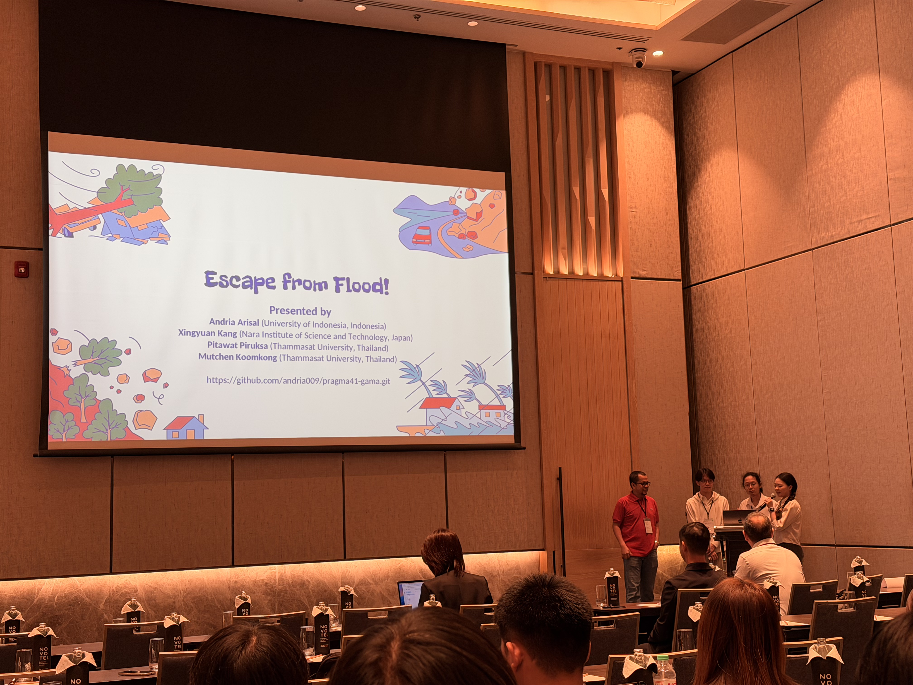

Ms. Kang Xingyuan と Mr. Papon Choonhaklai は、それぞれの研究について、[PRAGMA 2026 in Bangkok, Thailand（PRAGMA 41）](https://www.pragma-grid.net/pragma41/)のTechnical Paperセッションにおいて発表を行いました。

本会議は、<b>Student Hackathon</b> と <b>Presentation</b> の2つのパートで構成されています。

<b>Student Hackathon</b>では、参加者はテーマごとにグループに分かれ、1日という限られた時間の中でAI応用をテーマとしたプロジェクトに取り組みました。例えば、私たちのグループは、緊急時における個別最適な避難経路を生成するAIシステムを開発し、GRAMAシミュレータを用いてエージェントの学習過程をモデル化しました。

Ms. Kang Xingyuan のグループプロジェクトはコミュニティから高い評価を受け、「Giant Award」を受賞しました。

続いて、<b>Presentation</b>セッションが行われました。まず、Ms. Kang Xingyuan が「Adaptive Reinforcement Learning for Dynamic Controller Placement in Distributed SDN」と題した研究を発表しました。本研究の詳細は以下の通りです：

> Kang Xingyuan, Keichi Takahashi, Chawanat Nakasan, Kohei Ichikawa, Hajimu Iida, "Adaptive Reinforcement Learning for Dynamic Controller Placement in Distributed SDN", PRAGMA 2026, January 8–11, 2026.

本研究は，分散型Software-Defined Networking（SDN）におけるコントローラ配置問題（CPP）に対し，適応的な強化学習（RL）手法を提案する。従来の多目的最適化手法は，動的環境において柔軟性の不足や計算コストの高さにより適用が困難である。本研究ではCPPを逐次的意思決定問題として定式化し，RLエージェントがネットワークとの相互作用を通じて最適な配置戦略を学習する。評価指標として，遅延を表すFlow Setup Time（FST）と負荷分散を示すVariance of Load Balancing（VOLB）を報酬関数に統合する。実トラフィックデータを用いた評価により，本手法はトラフィック変動やトポロジ変化に適応し，スケーラビリティの向上，通信オーバーヘッドの削減，およびネットワーク性能の改善に有効であることを示した。


<!-- Papon san's session -->
次に、Mr. Papon Choonhaklai が「A Comparative Study of GPU Sharing Techniques for Inference Workloads in Kubernetes Clusters」と題した研究を発表しました。本研究の詳細は以下の通りです：

> Papon Choonhaklai, Kohei Ichikawa, Kundjanasith Thonglek, Hajimu Iida, "A Comparative Study of GPU Sharing Techniques for Inference Workloads in Kubernetes Clusters", PRAGMA 2026, January 8–11, 2026.

本研究は，Kubernetesクラスタにおける機械学習推論ワークロードに対するGPU共有手法を検討し，資源利用効率を向上させるメトリクス駆動型スケジューリング手法を提案する。従来のGPU割当は粗粒度であり，特に推論処理においてはGPU資源の未活用が問題となる。本手法では，NVIDIA Multi-Process Service（MPS）とDCGMおよびPrometheusによるリアルタイムメトリクスを組み合わせ，GPU利用率およびメモリ使用量に基づいて動的にリソースを割り当てる。また，本システムはKubernetesネイティブなオペレータとして実装されている。BERTモデルを用いた推論実験の結果，従来手法と比較してGPU利用率の向上および実行時間の短縮が確認され，本手法がクラウドネイティブ環境におけるスループット向上に有効であることを示した。


また、Mr. Papon Choonhaklai の研究はコミュニティから高く評価され、第2位を受賞するとともに記念品が授与されました。
