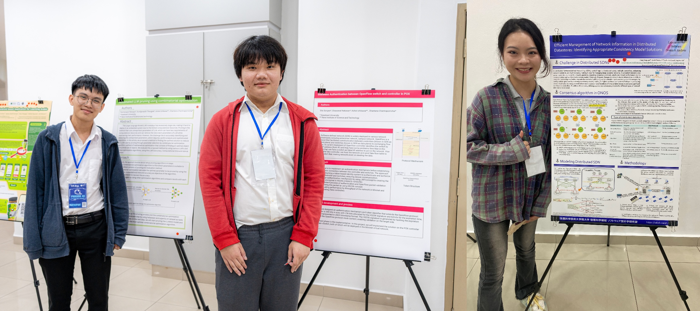

Ms.Kang Xingyuan(Mya), a second-year doctoral student at SDLab presented the following poster at the [40th meeting of the Pacific Rim Applications and Grid Middleware Assembly (PRAGMA 40)](https://www.pragma-grid.net/pragma40/). 

> Kang Xingyuan, Keichi Takahashi, Chawanat Nakasan, Kohei Ichikawa, Hajimu Iida, "Efficient Management of Network Information in Distributed Datastores: Identifying Appropriate Consistency Model Solutions", 40th meeting of the Pacific Rim Applications and Grid Middleware Assembly (PRAGMA 40), 9th October - 12nd October 2024.

The focus of this research is to improve the efficiency of SDN controllers in handling network events by identifying appropriate consistency models for different types of network information. In a distributed Software-Defined Network (SDN), control logic is distributed across multiple controllers, enhancing the network’s scalability and fault tolerance, making it an ideal solution for managing large-scale, dynamic networks. Maintaining a consistent network view across controllers is crucial for smooth operation and requires consensus protocols, which can impact performance due to communication and synchronization overhead between nodes. Moreover, frequent changes in network device information or shifts in controller mastership can further reduce efficiency, as controllers must continually adapt to new priority configurations governed by strong consistency model, resulting in higher overhead and delays in handling other critical tasks. Updating network information dozens or even hundreds of times is labor-intensive and increases the workload on controllers. To address these challenges, it is essential to define suitable consistency models tailored to the specific types of network information being processed.

In addition to her presentation, Jam and Ishikawa, students from Thailand who previously completed internships in our lab, also showcased the extended results of their research based on their internship projects. We joint both lightning talk session and poster seesion.

It is also exciting to share that Ms. Kang Xingyuan's research received widespread recognition from both professors and students during the poster session. She was honored to be awarded second place in the Best Poster competition.

Ms. Kang Xingyuan shared her thoughts: "I am truly delighted to have participated in PRAGMA 40; it has been an unforgettable experience. At PRAGMA 40, I witnessed many excellent research topics presented by talented students, which not only expanded my knowledge but also broadened my horizons. What made me happiest, however, was the opportunity to meet and connect with so many wonderful friends during the symposium. I will continue to work hard and strive to participate in the next PRAGMA!"

