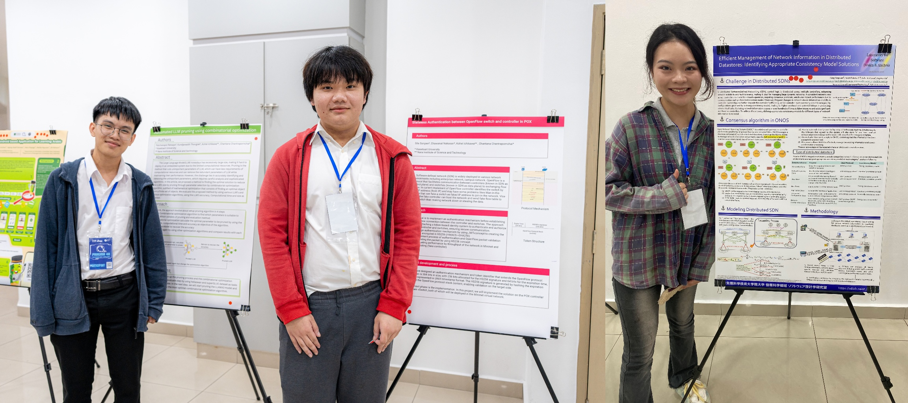

Ms. Kang Xingyuan（Mya）は，SDLabに所属する博士後期課程2年の学生として，[PRAGMA 2024 in Penang, Malaysia (PRAGMA 40)](https://www.pragma-grid.net/pragma40/) において，以下のポスター発表を行いました。

> Kang Xingyuan, Keichi Takahashi, Chawanat Nakasan, Kohei Ichikawa, Hajimu Iida, "Efficient Management of Network Information in Distributed Datastores: Identifying Appropriate Consistency Model Solutions", 40th meeting of the Pacific Rim Applications and Grid Middleware Assembly (PRAGMA 40), 9th October - 12nd October 2024.

本研究の目的は，ネットワーク情報の種類に応じて適切な一貫性モデルを特定することにより，SDNコントローラがネットワークイベントを処理する際の効率を向上させることである。分散型Software-Defined Network（SDN）では，制御ロジックが複数のコントローラに分散されることで，スケーラビリティと耐障害性が向上し，大規模かつ動的なネットワークの管理に適した構成となる。一方で，コントローラ間で一貫したネットワークビューを維持することは円滑な動作に不可欠であり，そのためにはコンセンサスプロトコルが必要となるが，ノード間の通信および同期に伴うオーバーヘッドにより性能に影響を及ぼす可能性がある。さらに，ネットワークデバイス情報の頻繁な変化やコントローラのマスタシップの移行は，強い一貫性モデルに基づく優先度設定の変更を伴うため，コントローラの負荷を増大させ，他の重要な処理の遅延を引き起こす要因となる。ネットワーク情報の更新が数十回から数百回に及ぶ場合，作業負担は大きくなり，コントローラの処理効率も低下する。これらの課題を解決するためには，処理対象となるネットワーク情報の特性に応じた適切な一貫性モデルを定義することが重要である。

また，本発表に加えて，以前本研究室でインターンシップを行ったタイの学生であるJamおよびIshikawaも，インターンシップ研究を基に拡張した成果を発表した。私たちはライトニングトークセッションおよびポスターセッションの両方に参加した。

さらに，Ms. Kang Xingyuan の研究はポスターセッションにおいて多くの教員および学生から高い評価を受け，Best Posterコンペティションにおいて第2位を受賞した。

Ms. Kang Xingyuan は次のように述べている：「PRAGMA 40に参加できたことを大変嬉しく思っており，忘れられない経験となりました。本シンポジウムでは，多くの優れた学生による研究発表を見て知識を深めるとともに，視野を広げることができました。そして何より，多くの素晴らしい仲間と出会えたことが最も嬉しかったです。今後も努力を続け，次回のPRAGMAにも参加できるよう頑張りたいと思います。」

