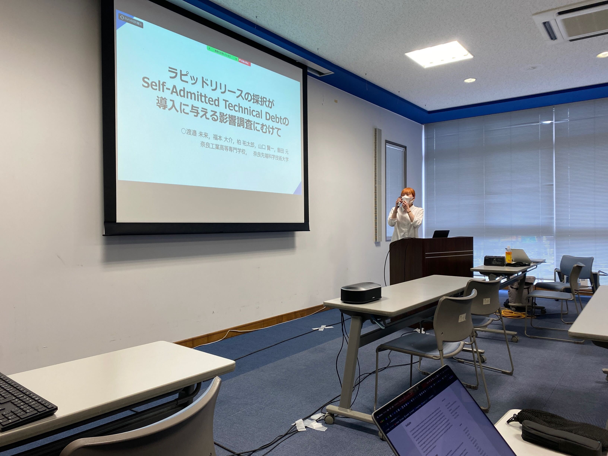

本研究室と共同研究をしている奈良工業高等専門学校専攻科1年の堀川康生君と渡邉未来さんが2023年3月14日〜15日にかけて開催されたSIGSS2023年3月研究会＠沖縄にて発表しました．

堀川君は[「テストコードのリファクタリングがテスト実行時間へ及ぼす影響調査にむけて」](https://ken.ieice.org/ken/paper/20230315wCSl/)というタイトルで，実際のOSS開発で行われるテストコードのリファクタリングの種類や頻度，および実行時間への影響について発表しました．

渡辺さんは[「ラピッドリリースの採択がSelf-Admitted Technical Debtの導入に与える影響調査にむけて」](https://ken.ieice.org/ken/paper/20230315mCSm/)というタイトルで，開発途中でラピッドリリースを採択したプロジェクトを対象に，採択前後の期間におけるSATD導入・削除の頻度を調査し発表しました．

なお，この共同研究は本学のインターンシップをきっかけに実現しました．本研究室のインターンシップでは，前半はソフトウェア工学の基礎の学習からスタートし，後半では教授とリサーチクエスチョンを決めて実際にソフトウェアリポジトリの分析を行います．興味がある学生は現在の専攻に問わずご参加ください．本学のインターンシップの詳細は[こちら](https://isw3.naist.jp/Admission/InternshipDomestic-ja.html)．

