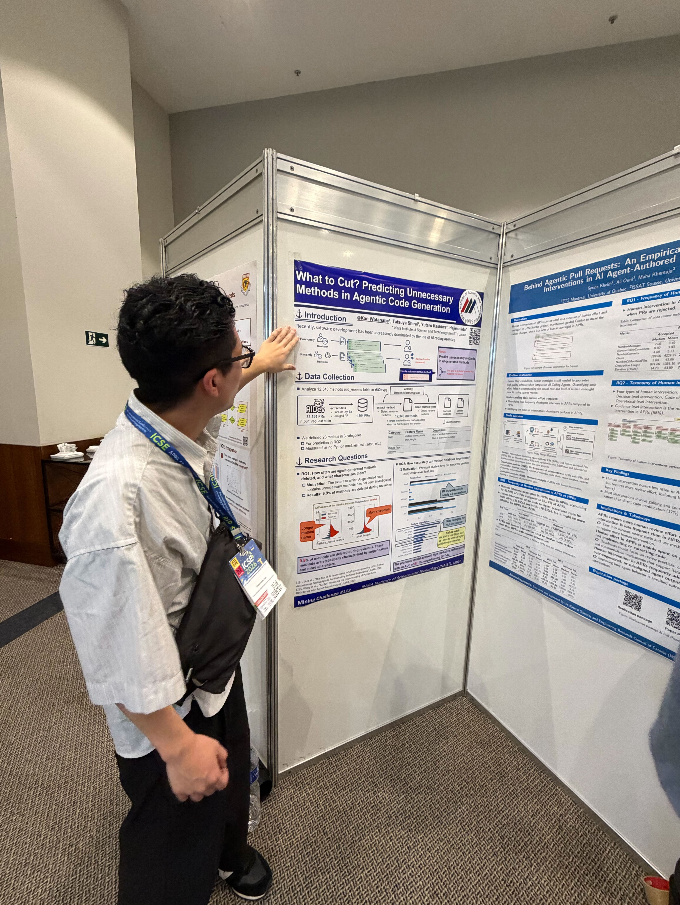

本研究室のメンバーが2026年4月12日〜18日にブラジル・リオデジャネイロで開催された[第48回ソフトウェア工学に関する国際会議(ICSE 2026)](https://conf.researchr.org/home/icse-2026)に参加し，併催された[第22回マイニングソフトウェアリポジトリ国際会議(MSR 2026)](https://conf.researchr.org/home/msr-2026)において下記の4本の論文を発表しました．MSRはマイニングソフトウェアリポジトリ分野におけるトップカンファレンスです．

> Kan Watanabe, Tatsuya Shirai, Yutaro Kashiwa, and Hajimu Iida,
> "What to Cut? Predicting Unnecessary Methods in Agentic Code Generation", In Proceedings of the 22nd International Conference on Mining Software Repositories (MSR 2026).

渡邊君が発表しました．本研究では，プルリクエストのレビュー時に削除されてしまうAI生成関数を，レビュアーがいかに効率良く特定できるかに取り組んでいます．削除理由ごとに関数の特徴が異なることを明らかにし，提案した予測モデルはこうした不要なメソッドをAUC 87.1%で特定できることを示しました．（[arXiv:2602.17091](https://arxiv.org/abs/2602.17091)）

> Tatsuya Shirai, Olivier Nourry, Yutaro Kashiwa, Kenji Fujiwara, and Hajimu Iida,
> "Does Programming Language Matter? An Empirical Study of Fuzzing Bug Detection", In Proceedings of the 22nd International Conference on Mining Software Repositories (MSR 2026).

本研究では，ファジングによるバグ検出にプログラミング言語の違いが影響するかどうかを，559個のOSSプロジェクトにわたる61,444件のファジングバグを対象に実証的に調査しています．その結果，言語がファジングの挙動に大きく影響することを明らかにしました．具体的には，C++とRustはバグ検出頻度が高い一方，RustとPythonは検出数こそ少ないものの深刻度の高い脆弱性を露呈する傾向があり，クラッシュの再現性やパッチカバレッジも言語によって顕著に異なることを示しました．本発表は，責任著者である柏 祐太郎 准教授が白井君に代わって行いました．（[arXiv:2602.05312](https://arxiv.org/abs/2602.05312)）

> Suzuka Yoshimoto, Shun Fujita, Kosei Horikawa, Daniel Feitosa, Yutaro Kashiwa, and Hajimu Iida,
> "Testing with AI Agents: An Empirical Study of Test Generation Frequency, Quality, and Coverage", In Proceedings of the 22nd International Conference on Mining Software Repositories (MSR 2026).

吉本さんが発表しました．本研究では，AIコーディングエージェントによるテスト生成を，その頻度・品質・カバレッジの観点から実証的に調査しています．その結果，テストを追加するコミットの16.4%がAIによるものであること，AIが生成したテストは行数が長く，アサーションが多い一方で循環的複雑度は低い傾向があり，人手で書かれたテストと同程度のコードカバレッジを達成していることを明らかにしました．（[arXiv:2603.13724](https://arxiv.org/abs/2603.13724)）

> Kyogo Horikawa, Kosei Horikawa, Yutaro Kashiwa, Hidetake Uwano, and Hajimu Iida,
> "Do AI Agents Really Improve Code Readability?", In Proceedings of the 22nd International Conference on Mining Software Repositories (MSR 2026).

本研究では，AIコーディングエージェントが実際にコードの可読性を向上させるのかどうかを，可読性向上を目的とした403件のコミットを対象に実証的に調査しています．その結果，直感に反して保守性指標(Maintainability Index)は56.1%のコミットで低下し，循環的複雑度(Cyclomatic Complexity)は42.7%のコミットで増加していました．エージェントはロジックの複雑さ(42.4%)やドキュメント(24.2%)の改善に注力していたものの，従来の品質指標はむしろ悪化させることが多いことを明らかにしました．第一著者の堀川 恭吾君は奈良工業高等専門学校からインターンシップとして本研究室に所属していたため，本発表は堀川 康生君が代わりに行いました．（[arXiv:2603.13723](https://arxiv.org/abs/2603.13723)）
