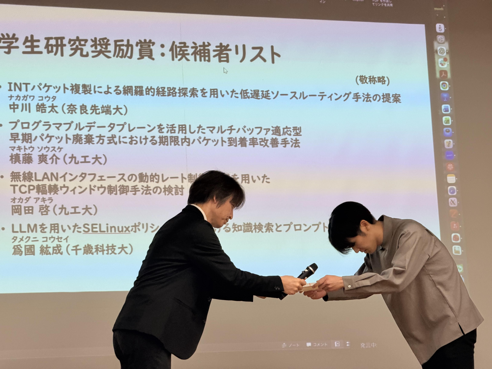

本研究室の中川皓太君が2026年3月3日に開催された[電子情報通信学会インターネットアーキテクチャ研究会](https://ken.ieice.org/ken/program/index.php?tgs_regid=1705f6c1f4d9b098dacd43164a48c997eba065ae60b780989aaf68c077a10b19&tgid=IEICE-IA)にて発表しました。

中川君は[「INTパケット複製による網羅的経路探索を用いた低遅延ソースルーティング手法の提案」](https://ken.ieice.org/ken/paper/20260303fcSU/)というタイトルで、In-band Network Telemetryを活用した遅延測定とSRv6によるソースルーティングに基づき，最小ホップ数に捉われない低遅延な経路を選択する手法について発表を行い、学生研究奨励賞をいただきました。

