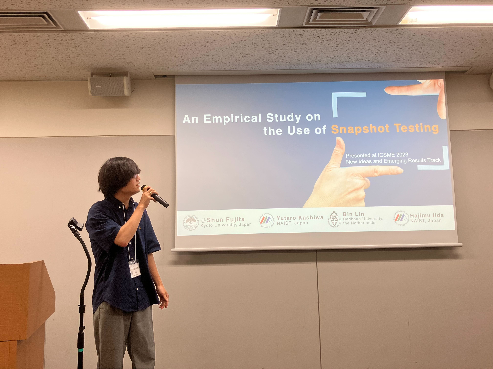
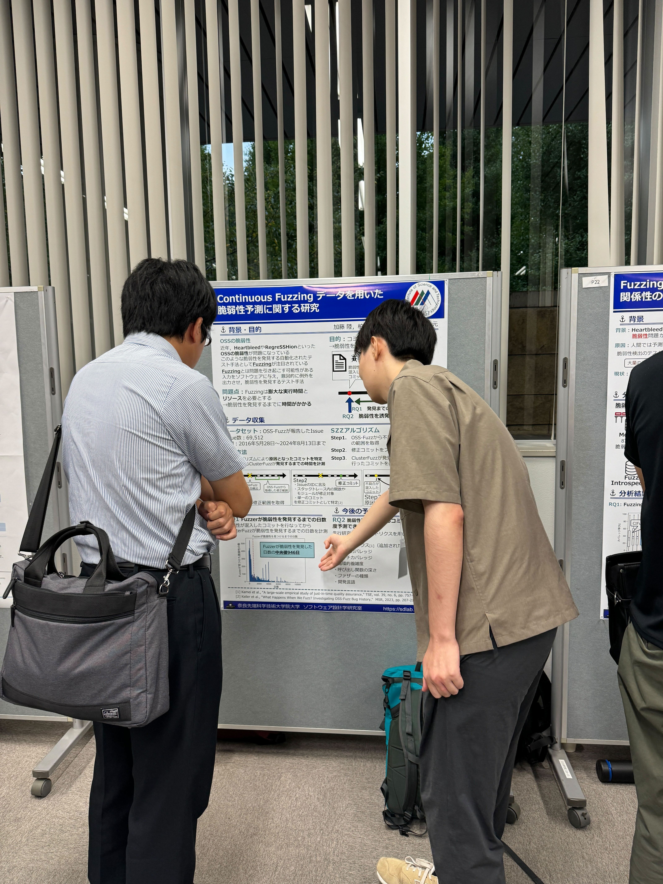
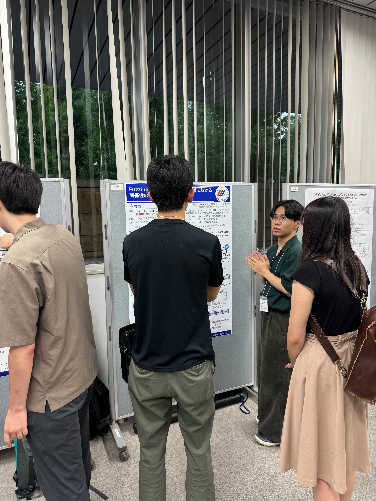

本研究室の藤田駿君，中村伊吹君，白井達也君，加藤陸君が2024年9月17日〜19日に行われた[ソフトウェアエンジニアリングシンポジウム2024(SES2024)](https://ses.sigse.jp/2024/)で発表を行いました．

中村君は一般論文トラックにおいて[「テストコードに存在するSelf-Admitted Technical Debtの実証的調査に向けて」](https://ipsj.ixsq.nii.ac.jp/ej/?action=pages_view_main&active_action=repository_view_main_item_detail&item_id=239243&item_no=1&page_id=13&block_id=8)というタイトルで，テストコードにおけるSATDの分布や種類について発表しました．テストコードには様々な種類のSATDが存在しており，既存研究には該当しないテストコード固有のSATDがあることを明らかにしました．

藤田君は既発表論文トラックにて，["An Empirical Study on the Use of Snapshot Testing"](https://ieeexplore.ieee.org/document/10336316) を発表しました．本研究は
既にICSME2023にて発表されたものです．
本研究ではスナップショットテストと呼ばれるReactなどの開発で広く用いられるテストがどのように利用されているかについて調査しました．GitHubプロジェクトから約1,500リポジトリを収集し，分析した結果，（1）スナップショットテストと単体テストを利用するプロジェクトでは，単体テストのみを用いるプロジェクトよりも，多くのテストを利用していること（2）8.2%のコミットでスナップショットファイルが変更され，その際には多くのファイルと同時に編集されること等を明らかにしました．

白井君はポスター展示トラックで「Fuzzingカバレッジと脆弱性検出における関係性の考察」を発表しました．本研究はソフトウェアテストであるFuzzingのカバレッジと脆弱性の関係性について調査しています．今回の発表では，Fuzzingにおいて，(1) 累積回数とカバレッジに相関がないこと，(2) カバレッジと脆弱性の検出率は比例せず，逆相関が強いことを報告しました．

加藤君はポスター展示トラックで「Continuous Fuzzingデータを用いた脆弱性予測に関する研究」を発表しました．本研究ではソフトウェアテストとして知られるFuzzingのデータを用いて，脆弱性のあるコードがリポジトリに追加された段階で発見する手法を提案します．今回の発表ではFuzzerがどの程度の期間で脆弱性を発見したのかを報告しました．

