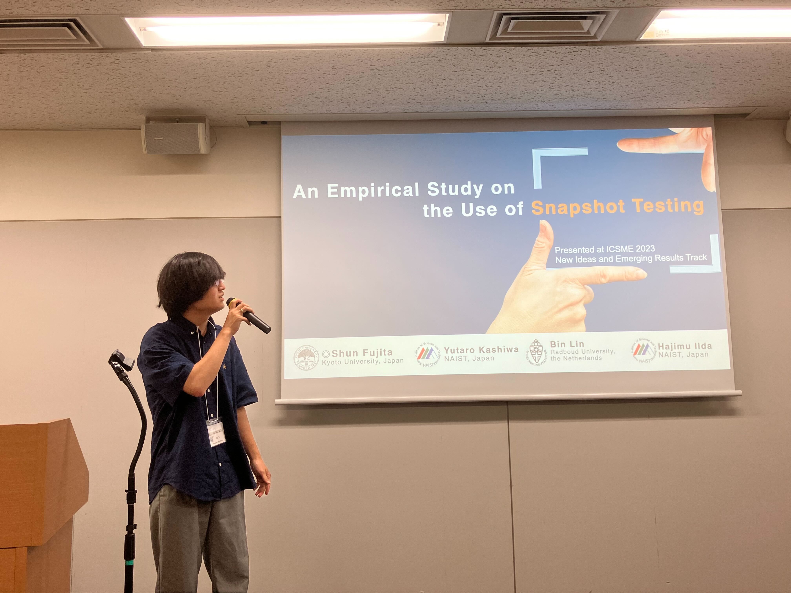
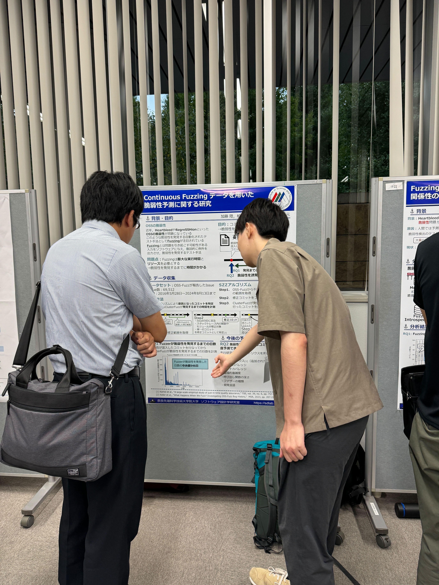
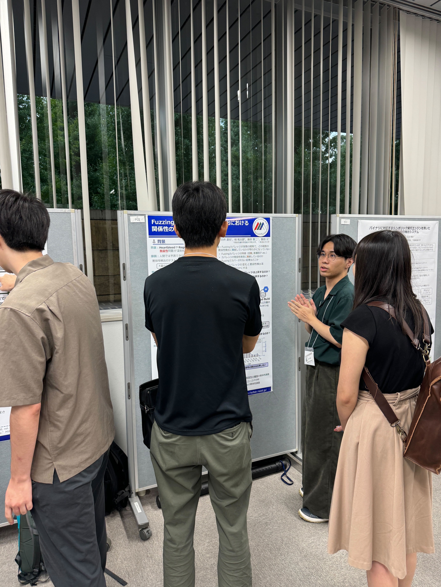

例
本研究室のM1馬渕君が第一著者として投稿した論文が[ソフトウェア工学の基礎ワークショップ（FOSE2023）](https://fose.jssst.or.jp/fose2023/)にてフルペーパー採録されました（論文名：「Dockerfile プリプロセッサの自動抽出に向けた ファイルアーキテクチャの調査」）．当該研究では，様々な環境や利用形態に対応したコンテナを提供するために利用されるDockerプリプロセッサのファイルアーキテクチャを調査しています．調査の結果，テンプレートを用いてDockerfileを複数生成するパターンや1つのDockerfileから複数のコンテナを生成するパターンなどを観察しています．なお，当該研究は大阪大学との共同研究として実施しています．

また，本研究室M1の米倉君と森川君，インターンシップの堀川君（奈良高専）と渡邉さん（奈良高専），藤田君（京都大学）がポスター発表を行いました．当該発表では投票が行われ，優秀な発表にはポスター賞が贈られています．投票の結果，米倉君と渡辺さんがポスター賞を受賞しました．44件の発表のうち受賞者は4件と9%の受賞率にも関わらず，本研究室から二人も受賞することができました！

