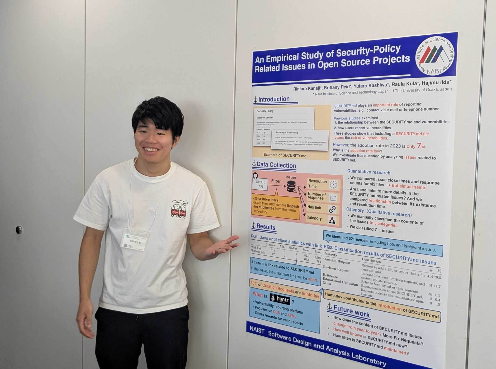
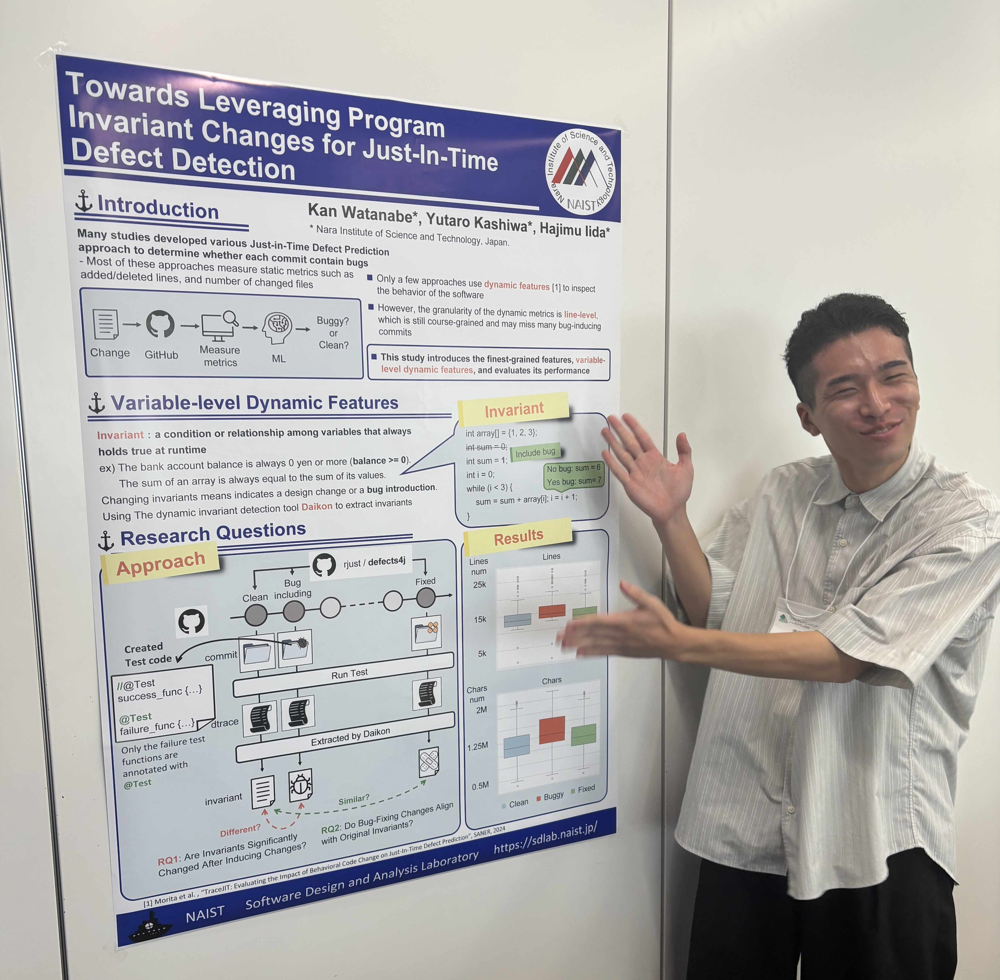

本研究室の柏祐太郎准教授，堀川康生君，白井達也君，金地琳太郎君，渡邊幹君が2025年9月16日〜18日にかけて行われた[ソフトウェアエンジニアリングシンポジウム2025 (SES2025)](https://ses.sigse.jp/2025/)で発表を行いました．

柏准教授はシンポジウム論文トラックにおいて[「シラバスから見る日本と海外におけるソフトウェア工学教育の違い：世界のトップ大学との比較」](https://ipsj.ixsq.nii.ac.jp/records/2004389)というタイトルで発表しました．分析の結果，日本におけるソフトウェア工学教育では演習形式の授業数が少なく，DevOpsやアーキテクチャに関する分野が十分に扱われていないことが判明しました．当該研究はシンポジウム論文として採録された論文の中でも特に優れた研究であるとして，「研究奨励賞」を受賞しました．

また，本研究室の堀川君，白井君，金地君，渡邊君はICSE2025勉強会及び学生国際英語ポスターセッションに参加しました．
ICSE2025勉強会は，ソフトウェア工学分野において最も権威がある国際学会ICSE(International Conference on Software Engineering)で採録された論文を紹介し，最新の研究動向を学ぶワークショップになっています．そこで，学生たちが実施している研究分野と関連している5本の論文について発表を行いました．
学生国際英語ポスターセッションにおいて，堀川君は"Understanding Refactoring in Test Code: An Empirical Study"というタイトルで発表しました．本研究はテストコード固有のリファクタリングの体系化と影響調査を実施しています．分析結果から，37種類のテスト固有リファクタリングを発見し，テストスメルに対して一定の効果を持つことが明らかとなりました．

白井君は "Does Programming Language Impact on Fuzz Testing?" というタイトルで発表しました．本研究では，Fuzzingにおけるプログラミング言語の影響を調査しています．発表では，不具合の発生頻度，脆弱性の発生割合，および脆弱性の重大性を6つの言語で比較しました．その結果，脆弱性が発生しにくい言語では，発生する脆弱性の重大性が高いことが明らかになりました．

金地君は，"An Empirical Study of Security-Policy Related Issues in Open Source Projects" というタイトルで発表しました．本研究では，SECURITY.mdファイルが普及していない原因を，本ファイルと関連するIssueの分析を通して調査しました．その結果，SECURITY.mdの導入がコントリビューターを混乱させているケースもあることが確認されました．

渡邊君は，"Towards Leveraging Program Invariant Changes for Just-In-Time Defect Detection"というタイトルで発表しました．JIT欠陥検出の動的特徴量としてinvariantが使用できないかという仮説から，テストコードで引っかかるエラーをinvariantの変化から検知できるかということ分析しました．結果としてバグ混入コミットのみinvariantの行数，文字数に変化が現れることが有意差と箱ひげ図で確認できました．

