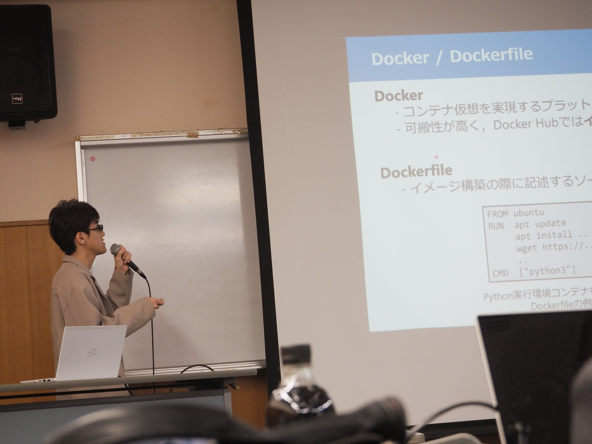
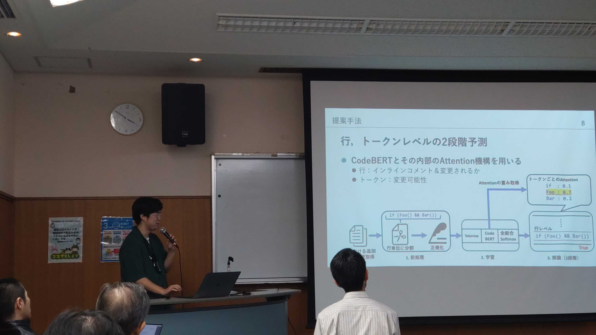

本研究室の三野天羽君，馬渕航君，森川靖仁君が2024年3月7日〜9日にかけて開催された
2024年3月ソフトウェアサイエンス研究会2024年3月にて発表しました．

三野くんは[「Equivalent Changesを考慮した不具合混入コミット特定アルゴリズムの開発」](https://ken.ieice.org/ken/paper/20240308ocC6/)
というタイトルでリファクタリングを考慮した新しいSZZアルゴリズムについて発表しました．先行研究では難しかったプログラミングの振る舞いを変えない変更（Equivalent Changes）をData Flow Graphを用いることで特定し，先行研究より精度を向上させることを明らかにしました．

馬渕くんは[「Dockerイメージ管理におけるDockerfile Preprocessor採用プロジェクトの特徴調査に向けて」](https://ken.ieice.org/ken/paper/202403086cCR/)
というタイトルでDockerfileのリリース管理におけるDockerプリプロセッサ（DPP）の効果を調査しました．DPP採用プロジェクトと不採用プロジェクトにおける特徴を調査し，DPP採用プロジェクトは
サポートするVersion数とTag数が中央値で4.0程度大きいこと，また，DPP採用プロジェクトの62%においてDPP採用後のコミット活動が活発になることを明らかにしました．

森川くんは[「CodeBERTを用いたトークンレベルでのレビューコメント箇所推薦手法の提案」](https://ken.ieice.org/ken/paper/20240307HcCJ/)
というタイトルでレビュアーの負担軽減を目的としたトークンレベルでのインラインコメント指摘箇所推薦手法を発表しました．事前学習言語モデルであるCodeBERTとそのAttention機構を用いることで，先行研究よりも更に細かな粒度であるトークンレベルでのインラインコメント指摘箇所推薦を発表しました．

