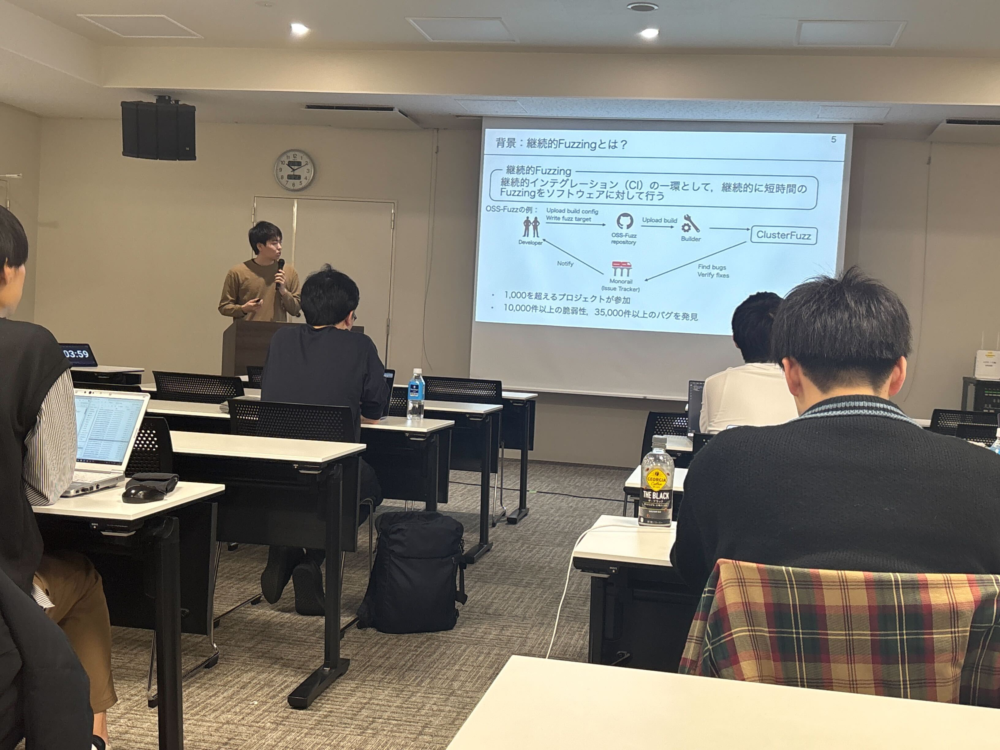

本研究室の白井達也君，加藤陸君が2025年3月10日〜12日にかけて開催された[
2025年3月ソフトウェアサイエンス研究会](https://ken.ieice.org/ken/program/index.php?tgs_regid=467a2ef7771c23683bb71c6ec6b3ca61a419e5c002fb2d05466b685a2ac8ce77)にて発表しました．

白井君は[継続的Fuzzingの有効性に関する大規模実証調査に向けて](https://ken.ieice.org/ken/paper/20250312uc8r/)
というタイトルで〜〜について発表しました．〜〜について明らかにしました．

加藤君は[継続的Fuzzingデータを用いたJust-In-Time脆弱性予測の提案](https://ken.ieice.org/ken/paper/20250312Xc8u/)
というタイトルでFuzzingの課題を解決することを目的とした継続的Fuzzingデータを用いたJust-In-Time脆弱性予測手法の提案について発表しました．実験の結果，提案手法は78件のOSSプロジェクトにおいて従来の特徴量を用いた予測手法より5.4%から13.6%高い性能で脆弱性を予測できることについて明らかにしました．

