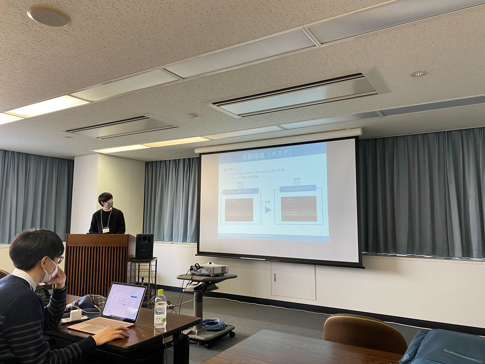

本研究室の福本大介君と井原輝人君が2023年1月20日〜21日にかけて開催されたウィンターワークショップ2023・イン・富山にて発表しました。

福本君は[「プロジェクトに適したコード補完モデルの実現に向けて」](https://ipsj.ixsq.nii.ac.jp/ej/?action=pages_view_main&active_action=repository_view_main_item_detail&item_id=223453&item_no=1&page_id=13&block_id=8)というタイトルで、深層学習を用いたコード補完が個々のプロジェクトに対して適したコードを提案できないという課題と、ドメイン適応を用いて解決する手法について発表しました。

井原君は[「Data Flow Graph を用いた自動コードレビューに向けて」](https://ipsj.ixsq.nii.ac.jp/ej/?action=pages_view_main&active_action=repository_view_main_item_detail&item_id=223454&item_no=1&page_id=13&block_id=8)というタイトルで、変数の依存関係を考慮した深層学習モデルであるGraphCodeBERTを用いた自動コードレビュー手法について発表しました。

